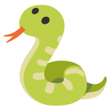

    <h1>
        
        Snake
    </h1>
    
    
     
    <strong>A reimplementation of the classic snake game written in Rust, with desktop and web support via WebAssembly.</strong>

## Table of contents

1. [🚴 Prerequisites](#-prerequisites)
2. [🏠 Building](#-building)
3. [🔗 Attribution](#-attribution)

## 🚴 Prerequisites

* [Git][git]
* [Latest build of Rust Nightly][rustup]
* * `rustup target install wasm32-unknown-unknown`
* * `cargo install -f cargo-binutils` 
* * `rustup component add llvm-tools-preview` 
* [`rui314/mold` linker][mold] 
* [`michaeleisel/zld][zld] 
* [Trunk][trunk]
* [NodeJS + NPM][nodejs]

## 🏠 Building

* `cargo build --release` 
* `trunk build --release` 

## 🔗 Attribution

1. [`tabler-icons.io`](https://tabler-icons.io) for their icons used in this markdown file.

[git]: https://git-scm.com/
[rustup]: https://rustup.rs
[trunk]: https://trunkrs.dev
[nodejs]: https://nodejs.org/en/
[mold]: https://github.com/rui314/mold
[zld]: https://github.com/michaeleisel/zld